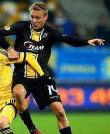

## TESTING --- Welcome to GitHub Pages

Een statistisch en historisch overzicht van alle Oud-Heverlee Leuven spelers die ooit voor de eerste ploeg op het wedstrijdblad stonden, sinds het ontstaan van de club in 2002.
An A-Z compilation of every player to appear on the match sheet for Oud-Heverlee Leuven in at least one official game since the foundation in 2002.

# Header 1
## Header 2
### Header 3

- Bulleted
- List

1. Numbered
2. List

**Bold** and _Italic_ and `Code` text

[Link](https://en.wikipedia.org/wiki/Jordan_Remacle) and 
```
